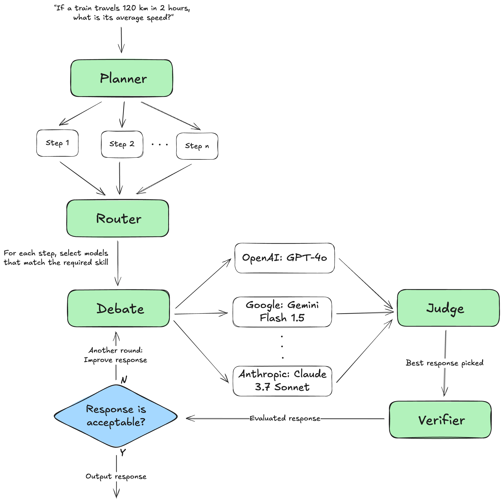

# Agentic Workflow Orchestrator

## Overview
This repository presents an Agentic Workflow Orchestrator—a modular framework for coordinating multiple AI agents in complex, collaborative decision-making pipelines. The system enables the integration of diverse agent roles (planning, judging, debating, verifying, and routing) and supports interaction with various AI providers through an adapter pattern.

## Architecture


## Getting Started

### Prerequisites
- Python 3.11+
- API keys for supported AI providers (e.g., OpenAI, Google)

### Setup


1. **Clone the repository:**
    ```sh
    git clone <repo-url>
    cd agentic-workflow-orchestrator
    ```

2. **Create and activate a virtual environment:**
    ```sh
    python3 -m venv .venv
    source .venv/bin/activate
    ```

3. **Install dependencies:**
    ```sh
    pip3 install -r requirements.txt
    ```

4. **Configure environment variables:**
  - Example environment file is provided as `.env.example` in the `app/` directory.
  - To configure your environment:
    1. Copy the example files to their active counterparts:
        ```sh
        cp app/.env.example app/.env
        ```
    2. Edit it to set your API keys. For example:

        ```sh
        OPENAI_API_KEY=your-key
        GOOGLE_API_KEY=your-key
        ```

5. **Run the orchestrator**
    ```sh
    cd app
    python3 main.py
    ```